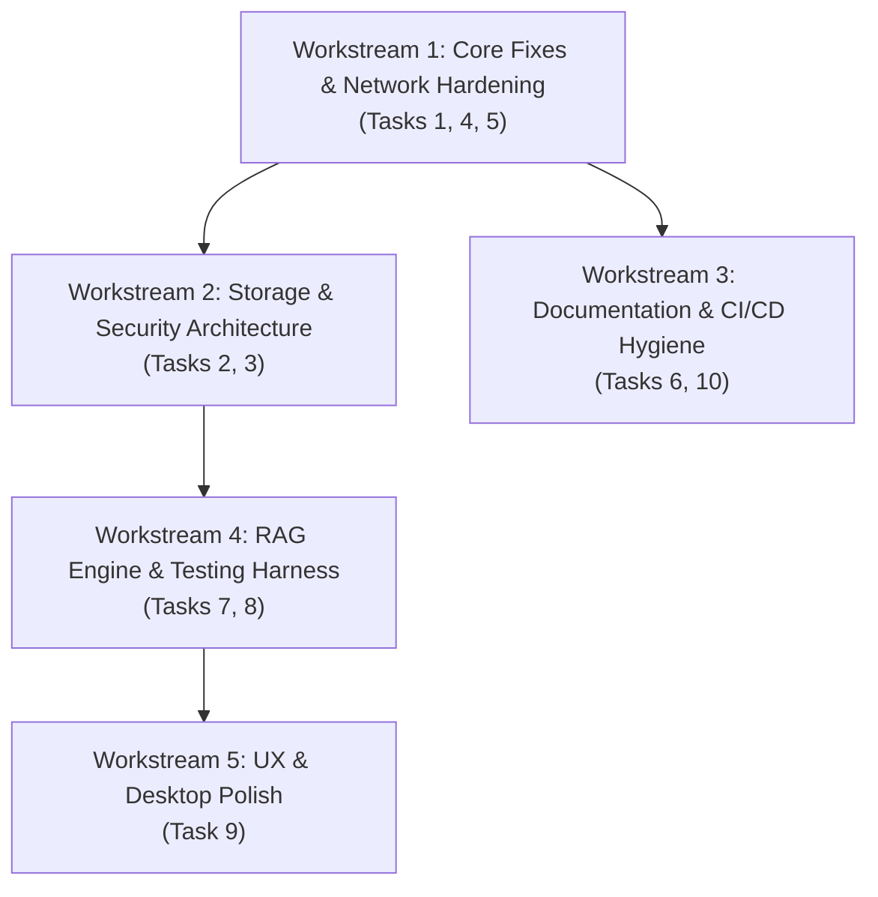

# CLAN AI — Prioritized Roadmap & Modular Implementation Plan

This implementation plan organizes the 10 roadmap recommendations into **5 distinct, self-contained Workstreams** optimized for sequential execution by a local **Qwen 3.6 35B (A4B)** model using `opencode`.

Each workstream includes:
- **Target Files & Exact Symbols**
- **Detailed Step-by-Step Instructions**
- **Constraints & Edge Cases**
- **Verification Commands (`flutter analyze`, specific `flutter test` targets)**

---

## Workstream Breakdown Overview



| Workstream | Scope / Tasks Covered | Complexity for 35B Model | Test Target |
| :--- | :--- | :--- | :--- |
| **WS 1: Quick Fixes & Network Hardening** | Task 1 (Duplicate Repo), Task 5 (Avatar Downloader), Task 4 (Android Network Security) | Low (Single-file tweaks) | `flutter test test/data/ test/core/` |
| **WS 2: Storage & Security Overhaul** | Task 2 (SQLite Characters + Avatars), Task 3 (Secure API Key Storage) | High (DB Schema v8 + Keychain) | `flutter test test/data/ test/domain/` |
| **WS 3: Docs, Hygiene & CI Pipeline** | Task 6 (AGENTS/README sync), Task 10 (CI workflow, dependency audit) | Low (Configs & Markdown) | `flutter analyze` & CI run |
| **WS 4: RAG & Real-Device Testing** | Task 8 (RAG config/forget/memory indicators), Task 7 (Platform test mocks & error flows) | Medium-High (Context builder & UI) | `flutter test test/ui/ test/network/` |
| **WS 5: UX Polish & Desktop Features** | Task 9 (Thread search, export with memories, desktop shortcuts) | Medium (UI components & filters) | `flutter test test/ui/` |

---

## Workstream 1: Core Fixes & Network Hardening

### Objectives
1. **Fix Duplicate CharacterRepository Instance (Task 1)**: Eliminate dual instantiation in [main.dart](file:///home/jstanton/CLAN-AI2/lib/main.dart) to prevent divergent in-memory state.
2. **Harden Avatar Downloader (Task 5)**: Add maximum byte-size limits (e.g., 5MB) and strict `Content-Type` validation to [st_avatar_downloader.dart](file:///home/jstanton/CLAN-AI2/lib/core/utils/st_avatar_downloader.dart).
3. **Tighten Android Network Security (Task 4)**: Ensure cleartext traffic in [network_security_config.xml](file:///home/jstanton/CLAN-AI2/android/app/src/main/res/xml/network_security_config.xml) is scoped properly to local IPs/debug environments rather than allowing global cleartext HTTP.

### Proposed Changes

#### [MODIFY] [main.dart](file:///home/jstanton/CLAN-AI2/lib/main.dart)
- Instantiate a single `final characterRepository = CharacterRepository();` prior to `runApp()`.
- Pass that instance to `RoleplayViewModel` and use `Provider<CharacterRepository>.value(value: characterRepository)` in the `MultiProvider` list.

#### [MODIFY] [st_avatar_downloader.dart](file:///home/jstanton/CLAN-AI2/lib/core/utils/st_avatar_downloader.dart)
- Add `maxSizeBytes` constant (default 5MB: `5 * 1024 * 1024`).
- Inspect `response.headers['content-type']` to ensure it begins with `image/` before consuming stream/bytes.
- Check `response.contentLength` if present, and reject if `> maxSizeBytes`.
- If reading via bytes/stream, abort if payload exceeds `maxSizeBytes`.

#### [MODIFY] [network_security_config.xml](file:///home/jstanton/CLAN-AI2/android/app/src/main/res/xml/network_security_config.xml)
- Set `<base-config cleartextTrafficPermitted="false">`.
- Scope `<domain-config cleartextTrafficPermitted="true">` to:
  - `localhost`, `127.0.0.1`, `10.0.2.2` (Android emulator loopback)
  - Common LAN subnets or specific host addresses used for llama.cpp instances.
  - Optional debug-overrides config: `<debug-overrides><trust-anchors><certificates src="user"/></trust-anchors></debug-overrides>`.

### Verification for WS 1
```bash
flutter analyze
flutter test test/core/utils/silly_tavern_card_parser_test.dart
```

---

## Workstream 2: Storage & Security Overhaul

### Objectives
1. **Migrate Characters & Persona Templates from SharedPreferences to SQLite (Task 2)**:
   - Prevent performance degradation and memory bloat from large JSON blobs/avatars in `SharedPreferences`.
   - Upgrade SQLite schema to **Version 8** with dedicated `characters` and `persona_templates` tables.
   - Store binary `avatar_data` (BLOB) in SQLite or local file cache.
   - Implement one-time automatic data migration from SharedPreferences to SQLite on first startup.
2. **Secure Storage for API Keys (Task 3)**:
   - Introduce `flutter_secure_storage` for storing API keys securely in iOS Keychain / Android KeyStore / Linux Secret Service.
   - Remove plaintext API keys from `ServerProfile` and `ServerConfig` JSON serialization in `SharedPreferences`.

### Proposed Changes

#### [MODIFY] [pubspec.yaml](file:///home/jstanton/CLAN-AI2/pubspec.yaml)
- Add `flutter_secure_storage: ^9.2.2`.

#### [MODIFY] [local_storage.dart](file:///home/jstanton/CLAN-AI2/lib/data/datasources/local_storage.dart)
- Bump DB version to `8`.
- In `_createDB` and `_upgradeDB` (v8):
  - Create `characters` table:
    ```sql
    CREATE TABLE characters (
      id TEXT PRIMARY KEY,
      name TEXT NOT NULL,
      personality TEXT NOT NULL,
      first_message TEXT NOT NULL,
      setting TEXT NOT NULL,
      user_persona TEXT NOT NULL,
      avatar_data BLOB,
      is_favorite INTEGER NOT NULL DEFAULT 0,
      system_prompt TEXT,
      post_history_instructions TEXT,
      alternate_greetings TEXT,
      created_at TEXT NOT NULL,
      updated_at TEXT NOT NULL
    );
    ```
  - Create `persona_templates` table:
    ```sql
    CREATE TABLE persona_templates (
      id TEXT PRIMARY KEY,
      name TEXT NOT NULL,
      persona_text TEXT NOT NULL,
      created_at TEXT NOT NULL,
      updated_at TEXT NOT NULL
    );
    ```
- Implement `_migratePreferencesToSqlite(Database db, SharedPreferences prefs)` during v8 upgrade.

#### [NEW] [secure_storage_service.dart](file:///home/jstanton/CLAN-AI2/lib/data/datasources/secure_storage_service.dart)
- Encapsulate `FlutterSecureStorage` with fallback for desktop platforms without a keyring.
- Methods: `saveApiKey(profileId, key)`, `getApiKey(profileId)`, `deleteApiKey(profileId)`.

#### [MODIFY] [character_repository.dart](file:///home/jstanton/CLAN-AI2/lib/data/repositories/character_repository.dart) & [persona_template_repository.dart](file:///home/jstanton/CLAN-AI2/lib/data/repositories/persona_template_repository.dart)
- Point CRUD operations to `LocalDatabase.instance.database` instead of `SharedPreferences`.

### Verification for WS 2
```bash
flutter analyze
flutter test test/data/
flutter test test/domain/models/model_roundtrips_test.dart
```

---

## Workstream 3: Documentation & CI/CD Hygiene

### Objectives
1. **Audit & Synchronize Agent Notes & Documentation (Task 6)**:
   - Correct test count discrepancies in [AGENTS.md](file:///home/jstanton/CLAN-AI2/AGENTS.md) and [README.md](file:///home/jstanton/CLAN-AI2/README.md).
   - Update [CHANGELOG.txt](file:///home/jstanton/CLAN-AI2/CHANGELOG.txt) with recent feature additions (Reasoning toggle, SillyTavern card v2, persona templates).
   - Create a clean `ARCHITECTURE.md` with system flow diagrams (Streaming, RAG, SQLite schema).
2. **CI Workflow & Package Pinning (Task 10)**:
   - Add `.github/workflows/ci.yml` running `flutter analyze` and `flutter test`.
   - Document the SQLite schema v1-v8 migration path in [AGENTS.md](file:///home/jstanton/CLAN-AI2/AGENTS.md).

### Proposed Changes

#### [MODIFY] [AGENTS.md](file:///home/jstanton/CLAN-AI2/AGENTS.md)
- Update total test files count, schema version reference (v8), and clean up outdated notes.

#### [NEW] [ci.yml](file:///home/jstanton/CLAN-AI2/.github/workflows/ci.yml)
- Set up GitHub Actions workflow on `push` and `pull_request` triggers for `ubuntu-latest` running Flutter 3.24+/Dart 3.5+.

#### [NEW] [ARCHITECTURE.md](file:///home/jstanton/CLAN-AI2/ARCHITECTURE.md)
- Detail MVVM layer responsibilities, SSE stream pipeline, SQLite schemas, RAG vector store architecture.

### Verification for WS 3
```bash
flutter analyze
flutter test
```

---

## Workstream 4: RAG Engine & Platform Testing Enhancements

### Objectives
1. **RAG & Memory Enhancements (Task 8)**:
   - Expose configurable RAG Top-K and similarity score threshold in character settings or generation parameters sheet.
   - Add per-character memory viewer / pruning ("forget memory") dialog in `RoleplayDrawer`.
   - Add visual indicator / chip in roleplay message view showing retrieved memories count (`rag_memory_count` already in schema).
2. **Platform & Real-Device Testing Harness (Task 7)**:
   - Write comprehensive tests for `ContextLimitExceededException` and `ServerOOMException` stream handling.
   - Add unit test coverage for file export fallback and cancellation under load.

### Proposed Changes

#### [MODIFY] [generation_params.dart](file:///home/jstanton/CLAN-AI2/lib/domain/models/generation_params.dart) & [roleplay_context_builder.dart](file:///home/jstanton/CLAN-AI2/lib/core/utils/roleplay_context_builder.dart)
- Support configurable `ragTopK` (1-10) and `ragMinScore` in context builder.

#### [NEW] [character_memories_dialog.dart](file:///home/jstanton/CLAN-AI2/lib/ui/features/roleplay/widgets/character_memories_dialog.dart)
- List all vector memories stored for a character.
- Allow deleting individual memories (`vectorStore.deleteEmbedding(id)`).

#### [MODIFY] [message_bubble.dart](file:///home/jstanton/CLAN-AI2/lib/ui/features/chat/widgets/message_bubble.dart)
- In roleplay mode, render a small memory chip if `message.ragMemoryCount != null && message.ragMemoryCount > 0` (e.g., "🧠 2 memories used"). Tapping displays the memories used.

### Verification for WS 4
```bash
flutter test test/features/roleplay/
flutter test test/data/datasources/vector_store_test.dart
```

---

## Workstream 5: UX & Desktop Polish

### Objectives
1. **Thread Search & Filter (Task 9)**:
   - Add search bar to Chat Drawer and Roleplay Drawer to filter conversation threads by title or message snippet.
2. **Character + RAG Export (Task 9)**:
   - Allow exporting character card JSON bundled with character vector memories.
3. **Desktop Keyboard Shortcuts (Task 9)**:
   - Support `Ctrl+N` / `Cmd+N` (New Chat), `Ctrl+K` / `Cmd+K` (Search Threads), `Ctrl+,` (Open Settings), `Escape` (Stop generation).

### Proposed Changes

#### [MODIFY] [chat_drawer.dart](file:///home/jstanton/CLAN-AI2/lib/ui/features/chat/views/chat_drawer.dart) & [roleplay_drawer.dart](file:///home/jstanton/CLAN-AI2/lib/ui/features/roleplay/views/roleplay_drawer.dart)
- Add a filter textfield at top of drawer that filters `threads` in-memory by thread title.

#### [NEW] [desktop_keyboard_shortcuts.dart](file:///home/jstanton/CLAN-AI2/lib/ui/shared/widgets/desktop_keyboard_shortcuts.dart)
- Wrap root app screen in `CallbackShortcuts` / `Focus` with shortcut bindings.

### Verification for WS 5
```bash
flutter analyze
flutter test
```

---

## Execution Guide for OpenCode / Qwen 3.6 35B

When working with `opencode` and Qwen 3.6 35B:
1. **Execute One Workstream at a Time**: Complete Workstream 1 first, run `flutter test`, verify clean analysis, then proceed to Workstream 2.
2. **Pass Specific File Targets**: Direct the model to only the 2-4 files in each sub-task to keep its attention and reasoning focused.
3. **Run Lint and Tests Between Each Step**: Always execute `flutter analyze` and `flutter test` after modifying any file.
